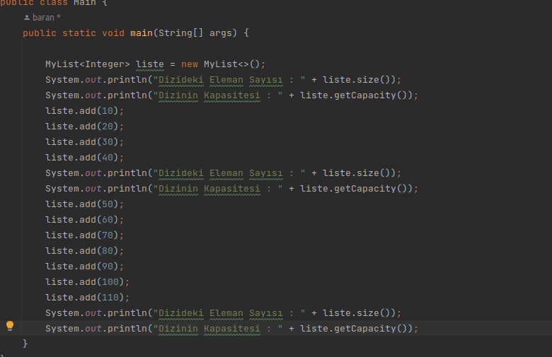
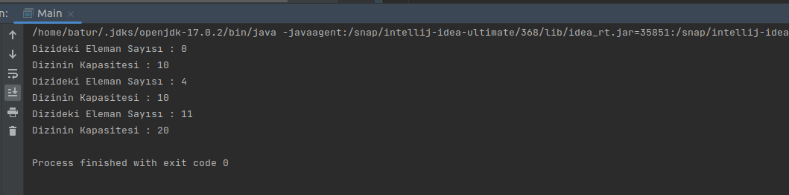
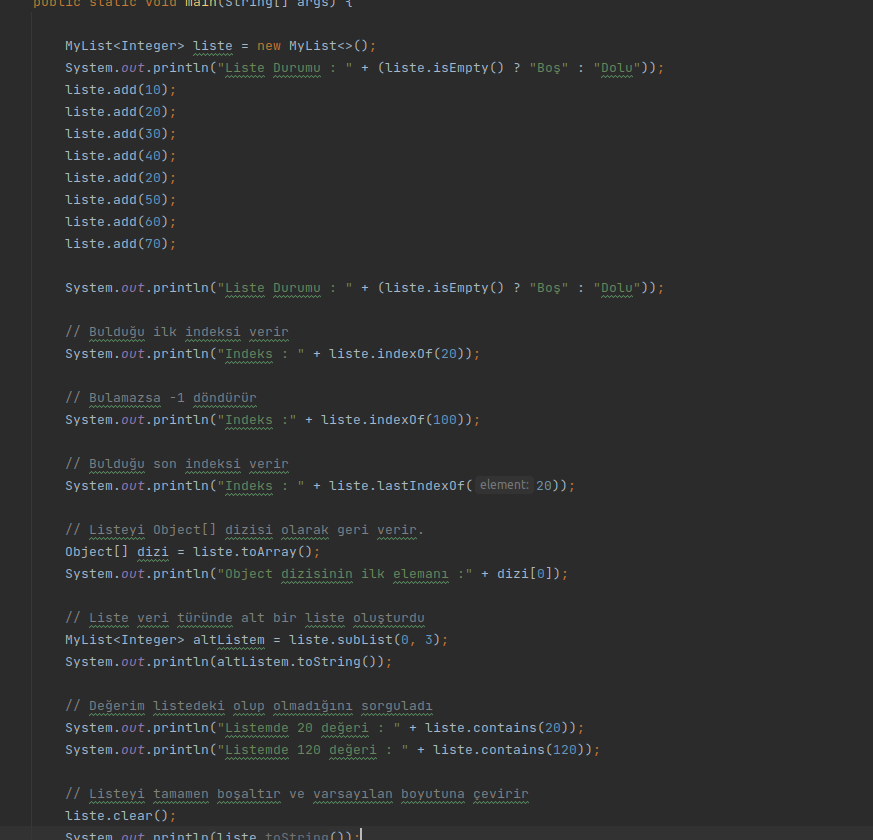
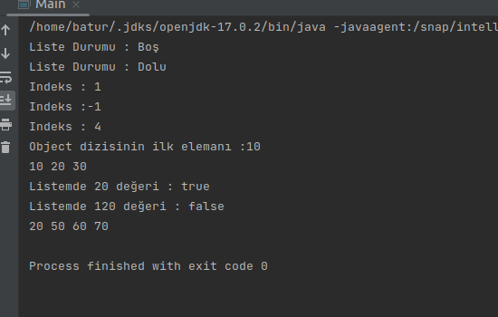

# CreateMyList With Using Generics Classes in Java

#### Writing Our Own List Class

- We are designing a class using global settings in Java.

- The purpose of the class is to hold a dynamic Array (Array) and dynamically retrieve its data type. A generic school
  is trained for this.

    - The class is designed to be used in a dynamic way.

- ##### Example 1:

- ##### Output

- ##### Example 2:

- ##### Output

